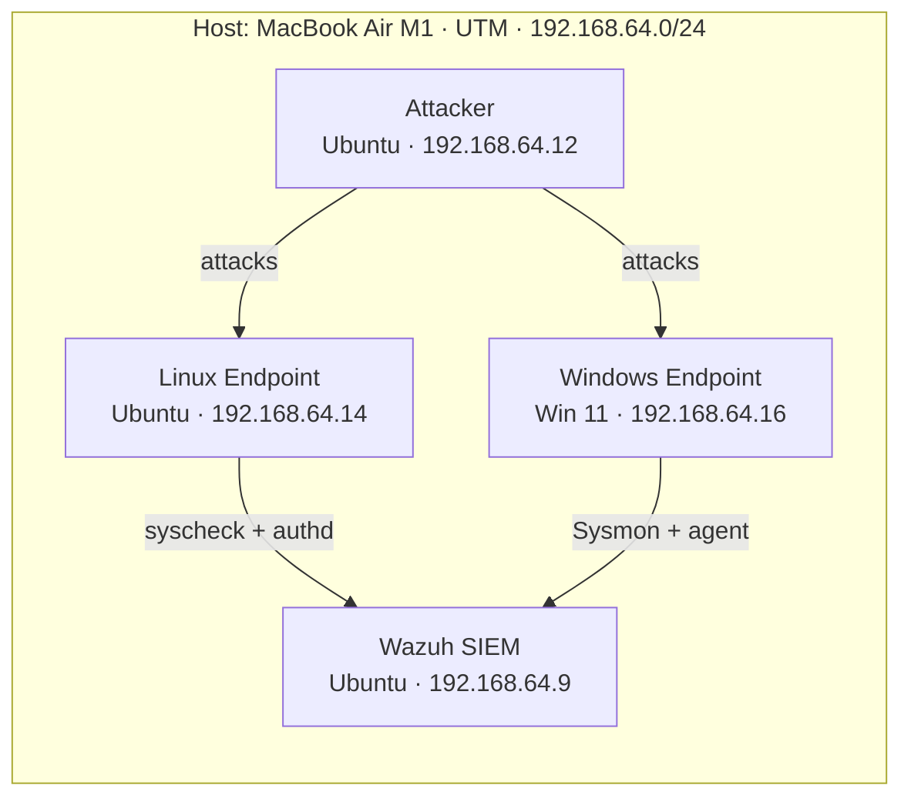

# SOC L1 Homelab Using UTM on Apple Silicon

## Wazuh-based Detection & Response

A personal cybersecurity home lab built on a single MacBook Air (M1) running
`UTM` as the hypervisor. The lab simulates a small enterprise environment
with endpoints, a SIEM (Wazuh), and an isolated attacker box, and is used to
practice detection engineering, threat hunting, and incident response.

> Live documentation, lab write-ups, and detection artifacts are versioned here
> to demonstrate hands-on capability to recruiters and reviewers.

## Architecture at a glance



## Repository contents

```
homelab/
├── README.md                  ← you are here
├── docs/
│   ├── architecture.md        ← host/hypervisor/network design + rationale
│   ├── setup-guide.md         ← step-by-step build instructions
│   └── network-topology.md    ← IP plan, ports, data flow
├── labs/
│   ├── lab-01-soc-siem-deploy/README.md
│   ├── lab-02-log-onboarding/README.md
│   ├── lab-03-attack-detection/README.md
│   ├── lab-04-detection-engineering/README.md
│   ├── lab-05-threat-hunting/README.md
│   └── lab-06-incident-response/README.md
└── detections/
    └── README.md              ← how custom rules are stored and tested
```

## Host & VM inventory

| Component       | OS / Software      | RAM      | vCPU | Disk      | IP            |
|-----------------|--------------------|----------|------|-----------|---------------|
| Host            | macOS (M1)         | 8 GB     | 8    | 512 GB    | —             |
| External drive  | —                  | —        | —    | 1 TB (200 GB partition) | —             |
| SOC-SIEM        | Ubuntu + Wazuh     | 4 GB     | 2    | 60–80 GB  | 192.168.64.9  |
| Linux Endpoint  | Ubuntu Server      | 1 GB     | 1    | 20–30 GB  | 192.168.64.14 |
| Windows Endpoint| Windows 11         | 2–3 GB   | 2    | 50–60 GB  | 192.168.64.16 |
| Attacker        | Ubuntu Server      | 1–2 GB   | 1    | 25–40 GB  | 192.168.64.12 |

> **Memory note:** the host has 8 GB of unified RAM and the four VMs request
> up to ~10 GB combined. Run the heavy SOC-SIEM VM together with one endpoint
> at a time, or accept macOS swapping during simultaneous runs.

## Lab series (portfolio)

| #  | Lab                       | Skill demonstrated                            |
|----|---------------------------|-----------------------------------------------|
| 01 | SOC-SIEM Deploy           | Wazuh manager + dashboard installation       |
| 02 | Log Onboarding            | Agent enroll, Sysmon, Linux audit, journald   |
| 03 | Attack Detection          | Simulated attacks → SIEM alerts               |
| 04 | Detection Engineering     | Custom rules + MITRE ATT&CK mapping           |
| 05 | Threat Hunting            | Hypothesis-driven hunts across endpoints      |
| 06 | Incident Response         | Containment, eradication, lessons-learned     |

Each `labs/lab-XX-*` folder contains its own README with objectives, steps,
expected outcomes, and the artifacts you should commit.

## How to use this repo

1. Follow `docs/setup-guide.md` to build the four VMs in UTM.
2. Walk the labs in order — each builds on the previous one.
3. Commit artifacts (custom rules, hunt notes, IR reports) to the matching
   `labs/` subfolder.
4. Keep `detections/` for reusable Wazuh rule XML and a short test harness.

## Authoring conventions

- Markdown for everything; Mermaid for diagrams (renders natively on GitHub).
- One lab per folder; never delete a finished lab — append `-v2` for reruns.
- Cite MITRE techniques as `TXXXX` with a link the first time in each doc.
- Redact any real data; this is a lab, but treat outputs like real evidence.


## Disclaimer

This homelab is for educational and defensive cybersecurity training only. All simulated attacks were performed in an isolated lab environment.

